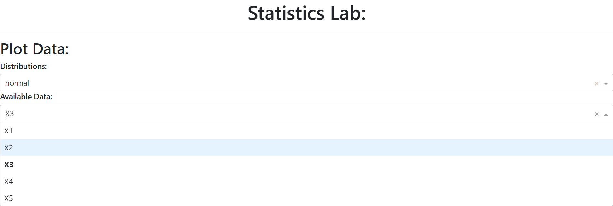
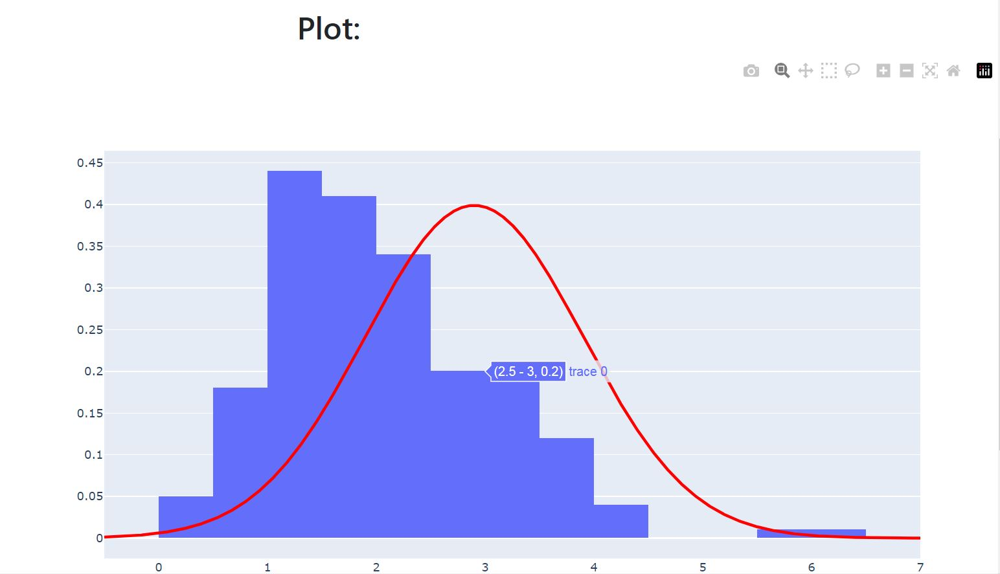
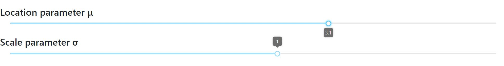

<p align="center">
	
	
  
  
</p>

# Building simple dashboard using Dash python library

# Table Of Contents
- [Overview](#overview)
- [Getting Started](#getting-started)
- [Application's Structure Details](#structure)
- [Examples & Usage](#examples)

## Overview <a name="overview"/></a>

This repository contains code for creating a simple **dashboard** using Plotly's Dash. 
The final dashboard includes **interactive** plots that describe histograms for five different data samples and five distributions that can estimate the data. (Images are provided in the 'Examples & Usage' section.)"

## Getting Started  <a name="getting-started"/></a>

To run or create this application, you'll need the *Dash, dash_bootstrap_components, NumPy, Pandas, Plotly,* and *SciPy* libraries, with versions specified in the '**requirements.txt**' file. 

Then, simply execute the 'main.py' script.
```
..:\app\working\directory>python main.py
```

## Application's Structure Details <a name="structure"/></a>

The core idea of Dash is to write web dashboards **without writing any CSS or HTML code**. While this statement is true, it can lead to some frustration in the future.
Yes, you won't create CSS/HTML files for your Dash project, but you WILL use some web application **logic and structure** to build a more complicated Dash app (something more complex than 'Hello World!').

However, this wasn't a problem for me - a Python ML enthusiast who **doesn't know a thing about** web development. This is because Dash provides a really easy-to-follow structure and instruments that will help you build these structures:

### *Dash()* - Main Application Element:

First things first - we need to create an app using the **Dash()** class. We can set the .title and .layout attributes of the app and then simply run it using the **.run()** method.

### *.layout* - Where the Whole Structure of the App Is:
The layout is enclosed within an **html.Div** component, which acts as a container for all other elements. This is akin to a *div* in HTML, providing a way to group elements together.
One can understand the Div component as a block of content on a web page that contains some simple web elements such as *text headers, horizontal line dividers, buttons, etc*. It's worth mentioning that a Div can (and will) contain other Divs as well!

Various components are included within our app's **layout**, such as *dropdowns, histograms,* and *sliders*. These are generated using custom functions (**distr_render, data_render, hist_render, and sliders_render**) which return HTML Div blocks.
These Div objects don't differ in an extreme way from their 'parent blocks'; they just represent more concrete elements of the Dash app.

### html. and dcc. Objects - These Are Our 'Bricks':

When it comes to creating our Div block elements, I can divide them into two groups:

 - If you need some basic web objects, like text or a button, you'll find them in the **dash.html class**.
 - Looking for more **complex** interactive web elements? See the **Dash.dcc** class (Dash Core Components). There you'll find customizable, fancy-looking sliders, dropdown menus, graphs, and so on.

### Input/Output Idea - Creating Relations Between Your Elements
If you want your button to affect the application's plot, take a look at dash.dependencies **.Input and .Output** functions. Combined with your application's .callback(Input, Output) decorator, you can easily create a **relationship** between the app's elements. The Input function takes two positional arguments:

 - The **id** of the element that provides information, such as a slider's custom id (ids.MI_SLIDER in my app).
 - The **value** of the element in which we are interested (the 'value' of the slider)

## Examples & Usage <a name="examples"/></a>

Based on the logic of the structure and web elements described above, we can now see a working example of my Dash app:

### Dropdown Menus with Multiple Values Available, Each to Modify the App's Plot

<p align="center">
	
</p>

### Graph object that represent interactive plot with data

<p align="center">
	
</p>

### Two sliders to control distribution's parameters 

<p align="center">
	
</p>


## And... Thats it!
Hope my repo helped you to understand plotly's Dash better! 
*See ya next time...*
